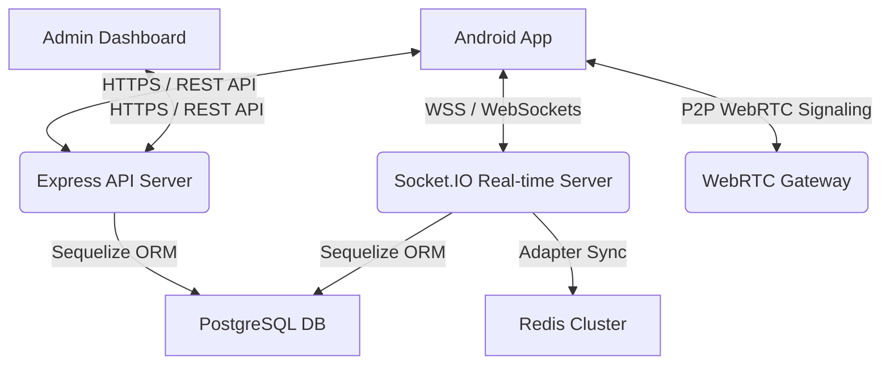

# System Architecture & Technical Specifications

This document outlines the architecture, data flows, and technical choices that power the WexSay messaging platform.

---

## 🏗️ High-Level System Architecture

WexSay operates on a three-tier architecture: the **Android Mobile App**, the **Node.js Express + Socket.IO API Backend**, and the **PostgreSQL Database + Redis Cache**.

---

## 📱 Mobile Architecture (Android Client)

The mobile client is built as an offline-first native Android application using:
* **Jetpack Compose:** Fully declarative, responsive UI components.
* **MVVM Architecture:** Clean separation of concerns between UI views, ViewModels, and local/remote repositories.
* **Room Database:** Local SQLite persistence. On app startup or network reconnection, the client fetches new message backlogs from the server and syncs them directly with Room. The UI observes database query flows in real-time, ensuring instant rendering.
* **Socket.IO Client:** Persistent WebSocket connection for instant, real-time message exchange and user presence notifications.
* **WebRTC Integration:** Native peer-to-peer calling framework for low-latency audio and video transmission.

---

## 🖥️ Backend Architecture (API & Real-time Engine)

* **Express API Gateway:** Handles user registration, verification, contact uploads, theme asset delivery, and administration panel commands.
* **Socket.IO Socket Server:** Manages active user WebSocket sockets. Handles message deliveries, typing indicators, read receipts, and presence alerts.
* **Redis Pub/Sub Adapter:** Coordinates WebSocket events across multiple server instances to support scaling.
* **Sequelize ORM:** Manages relations, joins, indexes, and database schema updates for PostgreSQL.

---

## 🔒 Security Specifications

* **Local Data Encryption:** Mobile client local storage configurations and token parameters are encrypted utilizing 256-bit AES cryptographic wrappers. Standard XML SharedPreferences are blocked.
* **Transport Encryption:** All transit frames utilize TLS 1.3 (HTTPS/WSS). Cleartext traffic is disabled on the Android manifest.
* **Admin Authentication:** Access tokens are delivered and verified utilizing secure, server-side `HttpOnly` cookies, preventing XSS-based token theft.
* **Upload Hardening:** Uploaded media attachments are validated against a strict MIME-type and extension mapping on the server, blocking executable uploads.
* **Graceful Exception Handlers:** Server errors close open database connection pools and safely restart instances, preventing memory leaks or transactional locks.
